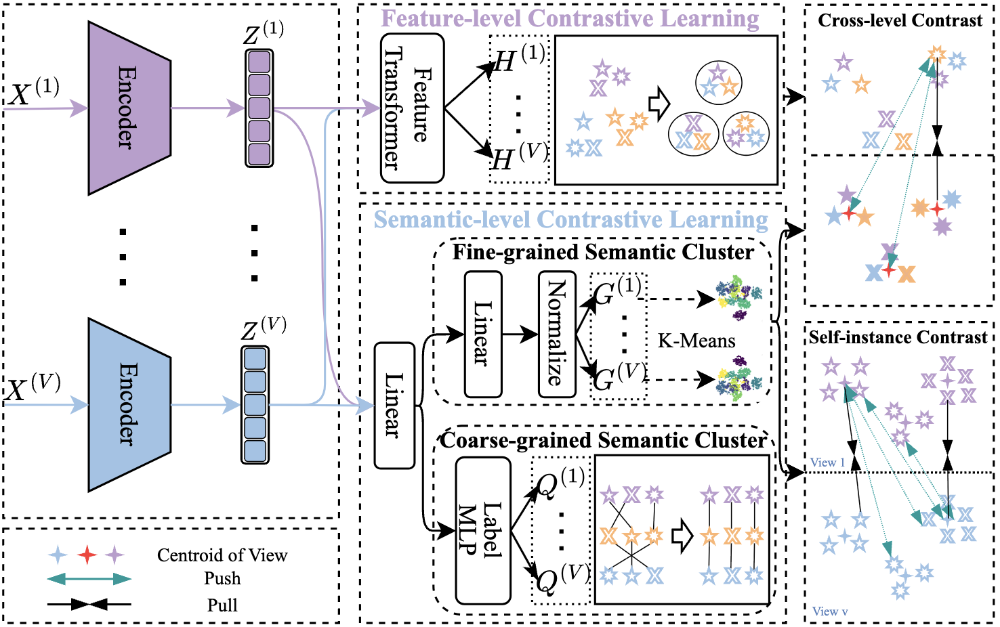

# <p align=center> Cross-level Interaction and Multi-granularity Contrastive Learning for Multi-view Clustering </p>

>**Authors:**
Shanghui Deng, Chang Tang, Xiao Zheng, Yuanyuan Liu, Kun Sun, Xinwang Liu

This repository contains simple pytorch implementation of our paper [CLMGC](https://www.sciengine.com/SCIS/doi/10.1007/s11432-025-4667-2).

### 1. Overview
<p align="center">
   <br/>
</p>

### 2. Datasets
DHA, ESP-Game, Flickr, NUS-Wide, COIL20, and MSRCv1 datasets can be downloaded from [Baidu Clouds](https://pan.baidu.com/).

### 3.Usage

Train a new model:

````python
python train.py
````
### 4. Citation

Please cite our paper if you find the work useful:
```
@ARTICLE{deng2025cross,
  author={Deng, Shanghui and  Tang, Chang and Zheng, Xiao and Liu, Yuanyuan and Sun, Kun and Liu, Xinwang},
  journal={SCIENCE CHINA Information Sciences}, 
  title={Cross-level Interaction and Multi-granularity Contrastive Learning for Multi-view Clustering}, 
  year={2025},
  volume={},
  number={},
  pages={},
  doi={https://doi.org/10.1007/s11432-025-4667-2},
 }
```
